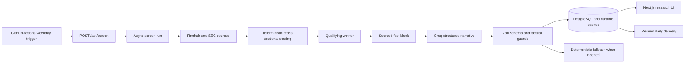

# Analysts Platform Submission Pack

**Project:** Analysts, a sourced daily public-equity research platform  
**Prepared:** 24 August 2026  
**Repository owner:** Festo Wampamba

## 1. Live application

- **Production:** [analysts.korestandard.com](https://analysts.korestandard.com/)
- **Development verification environment:** [dev-analysts.korestandard.com](https://dev-analysts.korestandard.com/)
- **Health endpoint:** [analysts.korestandard.com/api/health](https://analysts.korestandard.com/api/health)

The production application publishes the latest qualifying daily idea at `/` and supports on-demand ticker research at `/research/[ticker]`.

## 2. GitHub repository

[Festo-Wampamba/analysts](https://github.com/Festo-Wampamba/analysts)

The repository contains the application source, database migrations, automated tests, CI configuration, deployment documentation, and the architecture diagram.

## 3. Installation and local development

Requirements:

- Node.js compatible with the repository toolchain
- pnpm
- PostgreSQL
- Provider credentials listed below

```bash
git clone https://github.com/Festo-Wampamba/analysts.git
cd analysts
pnpm install
cp .env.example .env.local
pnpm db:migrate
pnpm dev
```

The local application is then available at `http://localhost:3000`.

Run the verification suite with:

```bash
pnpm test
pnpm lint
pnpm exec tsc --noEmit
pnpm build
```

Required runtime configuration includes `DATABASE_URL`, `FINNHUB_API_KEY`, `GROQ_API_KEY`, `CRON_SECRET`, and `SEC_USER_AGENT`. Chart providers and Resend delivery are optional; when unavailable, the application labels the affected section instead of inventing data or discarding the persisted result. The complete environment-variable reference is in [README.md](README.md).

## 4. Architecture diagram and system design

- [Architecture documentation](docs/architecture.md)
- [AI-Powered Equity Research Platform diagram](<Design%20Diagram/AI-Powered%20Equity%20Research%20Platform.pdf>)

At a high level:



The daily screen is asynchronous so a multi-minute provider workflow does not hold open the HTTP request. The homepage reads persisted results, while the research workspace combines the cached narrative with current quote, filing, chart, earnings, peer, and provenance data.

## 5. Data sources

| Source | Role in the platform | Controls |
|---|---|---|
| Finnhub | Quotes, profiles, metrics, peers, news, earnings, recommendations, and insider activity | Zod response schemas, bounded retry and timeout policy, provider cache, and source-call audit logging |
| SEC Company Facts | Annual revenue, profit, EPS, cash flow, capex, and balance-sheet values | Filing-period anchoring, annual history, and free cash flow only when compatible filing periods are available |
| Twelve Data / Alpha Vantage | Intraday and historical chart bars | Provider-specific cache windows and explicit bar timestamps |
| Groq | Structured daily-idea and research narratives | JSON schema validation, numeric allow-list, factual-claim guard, correction retry, and deterministic fallback |
| Resend | Daily-idea email delivery | Delivery status is persisted independently of the research result |

## 6. Stock-ranking methodology

The screen evaluates a fixed universe of 54 large- and mid-cap US companies across nine sectors. Each component is converted to a same-day cross-sectional percentile, so the score means relative strength against the available universe rather than an absolute investment grade.

| Factor | Weight | Inputs |
|---|---:|---|
| Growth | 20% | TTM revenue growth and TTM EPS growth |
| Profitability | 20% | TTM net margin and TTM return on equity |
| Valuation | 20% | Positive P/E and P/S, with lower multiples scoring better |
| Financial strength | 15% | Debt/equity and current ratio |
| Momentum | 15% | 13-week and 26-week price returns |
| Analyst sentiment | 5% | Buy and strong-buy share of current recommendations |
| Insider activity | 5% | Net insider share change over the lookback window |

Missing inputs are excluded and the remaining weights are renormalized; missing data is not treated as a zero score. A candidate must reach a composite score of at least `0.65` and at least `0.60` coverage of configured factor weight. Ties resolve alphabetically by ticker. The daily screen publishes no filler pick when no candidate clears both gates.

The LLM does not rank companies and cannot introduce a new candidate. It receives only the selected company’s sourced fact block after deterministic ranking. Generated prose is rejected and retried if it contains unsupported numbers, unsupported claims, or an unlisted ticker. If verification or the provider fails, deterministic sourced explanatory text is shown and labeled as fallback.

## 7. Estimated cost per research report

Planning estimate in USD, using Groq `openai/gpt-oss-120b` at approximately $0.15 per million uncached input tokens and $0.60 per million output tokens:

- Typical report assumption: 4,000 input tokens and 1,000 output tokens
- Normal generation: approximately **$0.0012 per report**
- Generation requiring one factual correction retry: up to approximately **$0.0024 per report**

These figures cover model usage only. Market-data subscriptions, hosting, database, email, and domain costs are separate.

## 8. Estimated monthly operating cost

For an illustrative low-volume workload of 22 scheduled daily ideas plus 100 manual reports per month:

- Normal model usage: approximately **$0.15/month**
- If every generation requires a correction retry: approximately **$0.30/month**
- Small VPS plus free or entry-level Neon and Resend tiers: approximately **$6–$10/month total**

The estimate excludes domain registration, taxes, regional hosting differences, and any paid market-data upgrade. Provider pricing should be rechecked before a production budget is approved.

## 9. Known limitations

- Quotes and chart bars come from different provider products and can be sampled at different times.
- The ranking universe is intentionally fixed and is not a complete market universe.
- Provider rate limits or outages can make a section unavailable; the UI preserves verified data and labels freshness.
- Finnhub is currently the single live quote source. Other providers support chart history but are not yet normalized quote failover sources.
- In-memory request coalescing and rate limits are local to the current single application instance and must move to shared infrastructure before horizontal scaling.
- This is research software, not investment advice or an automated trading system.

## 10. Improvements possible with two additional weeks

1. Add provider contract monitoring and alerts for stale quotes, filing-period mismatches, and cache failures.
2. Move rate limiting and request coordination to a shared store, and add a durable screen queue for horizontal scaling.
3. Expand the universe using maintained inclusion rules, sector-neutral controls, historical backtests, and score-drift monitoring.
4. Add accounts, saved research lists, report exports, and scheduled digest preferences while preserving provenance.
5. Complete DNS-01 certificate automation, wire `BUILD_SHA` into the deployment build, and add browser-level production smoke tests.

## 11. Verification and release status

The final development branch includes the research reliability, AI factual-guard, fallback UI, display-copy, and legacy-cache compatibility fixes.

- Local test suite: **297 tests passed**
- TypeScript: **clean**
- Production build: **passed**
- GitHub Actions verification: **passed**
- Development deployment: homepage and research endpoints return HTTP 200; `/api/health` reports healthy runtime state

For the detailed implementation history, see the pull request [#10](https://github.com/Festo-Wampamba/analysts/pull/10).
